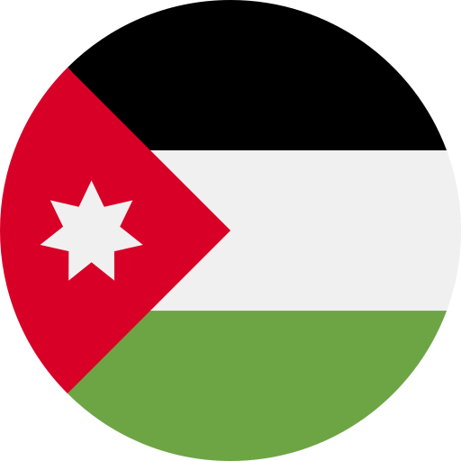

# جميع اللهجات العربية

##  مصر

-   المصرية العامية
-   المصرية الصعيدية
-   المصرية البحاروة الفلاحين

##  السعودية

-   الحجازية (مكة والمدينة والطائف)

-   النجدية (القصيم وحائل والرياض)

##  اليمن

-   الصنعانية
-   الحضرمية
-   العدنية

##  عمان

-   العمانية

##  الإمارات

-   الإماراتية

##  قطر

-   القطرية

##  البحرين

-   البحرينية

##  الكويت

-   الكويتية

##  موريتانيا

-   الموريتانية (حسانية)

##  ليبيا

-   الليبية

##  تونس

-   التونسية

##  الجزائر

-   الجزائرية

##  المغرب

-   المغربية الدارجة

##  السودان

-   السودانية

##  لبنان

-   اللبنانية

##  سوريا

-   السورية

##  الأردن

-   الأردنية

##  فلسطين

-   الفلسطينية

##  العراق

-   العراقية

